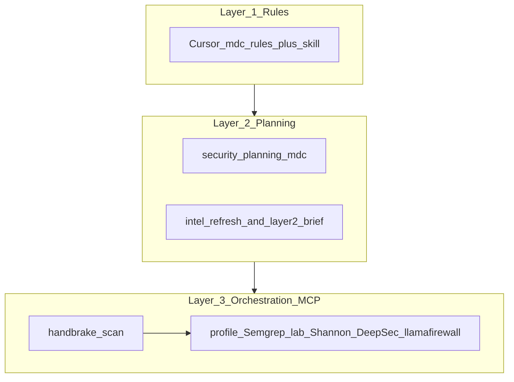
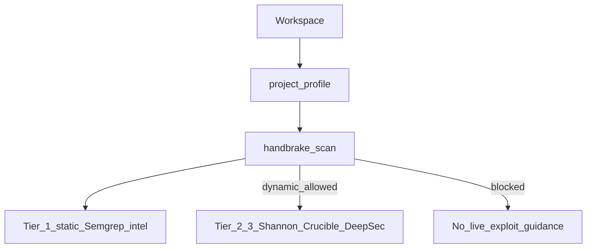
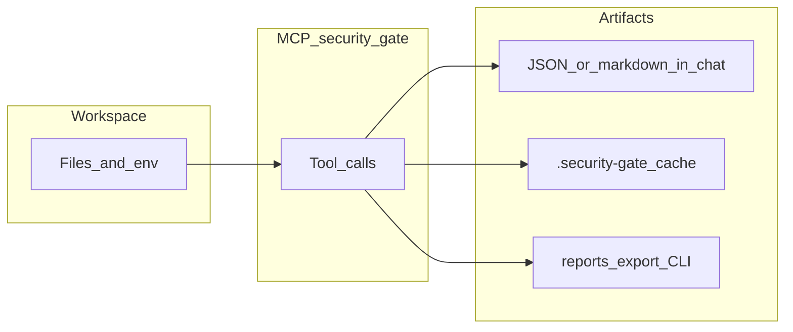
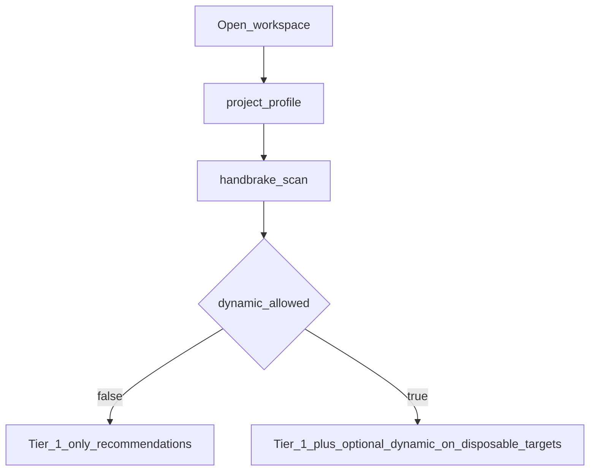

# Security Gate (Cursor Plugin)

Security Gate is an **open-source Cursor plugin** for safer development: **rules** before code, **evidence-grounded planning**, and an **MCP server** that coordinates Semgrep, intel feeds, optional labs, and Tier-2/3 tools — with a **production handbrake** so dynamic testing is never encouraged against production-like environments.

### Where to read next

| Goal | Document |
|------|------------|
| **Diagrams, flows, outputs per tool** | **[docs/ARCHITECTURE_AND_FLOWS.md](docs/ARCHITECTURE_AND_FLOWS.md)** |
| **Short Q&A** (what / why / keys) | **[docs/FAQ.md](docs/FAQ.md)** |
| **Install + smoke tests** | **[SETUP.md](SETUP.md)** |
| **Breakages** (MCP, Docker, ports) | **[docs/TROUBLESHOOTING.md](docs/TROUBLESHOOTING.md)** |
| **Env var matrix** | **[docs/LLM_AND_KEYS_MATRIX.md](docs/LLM_AND_KEYS_MATRIX.md)** |
| **Free vs paid LLM paths** | **[docs/FREE_VS_PAID_LLM.md](docs/FREE_VS_PAID_LLM.md)** |

---

## The three layers



- **Layer 1 — Rules:** `.mdc` rules steer secure defaults *before* code is written.  
- **Layer 2 — Planning:** an evidence-first planning rule plus **`intel_refresh`** / **`layer2_brief`** (KEV/OSV cache when populated).  
- **Layer 3 — Orchestration:** MCP tools — **`handbrake_scan`**, **`project_profile`**, **`intel_refresh`**, **`layer2_brief`**, **`lab_bootstrap`**, **`semgrep_scan`**, **`deepsec_review`**, **`shannon_pentest`**, **`llamafirewall_advisor`** — designed to **block dynamic testing** when production-like signals appear.

---

## Static vs dynamic (and where AI-backed tools fit)

| Path | What runs | Typical API keys | Handbrake |
|------|-----------|------------------|-----------|
| **Tier 1 — static** | Rules, `project_profile`, `intel_refresh`, `layer2_brief`, **`semgrep_scan`**, `llamafirewall_advisor` (advisor text) | **None** for core intel + OSS Semgrep | Still run before *recommending* dynamic work |
| **Tier 2/3 — dynamic + LLM** | `shannon_pentest`, Crucible via **`lab_bootstrap`**, **`deepsec_review`** scan | **Required** when those actions call a vendor LLM | **`dynamic_allowed: true`** and **disposable** targets only |

“AI” in Tier 2/3 means **Shannon / Crucible / DeepSec backends** — not the Cursor chat model. Tier 1 can stay **keyless** for the bundled OSS path.



---

## Typical flow: tools → outputs



| Output | Examples |
|--------|----------|
| In chat | JSON from `handbrake_scan`, markdown from `layer2_brief`, Semgrep summaries |
| Cache | `.security-gate/cache/*.json` from **`intel_refresh`** |
| Reports | **`npm run report:export`** → `FINAL_SECURITY_REPORT_*.md` ([template](docs/templates/FINAL_SECURITY_REPORT.template.md)) |
| Tool dirs | `.deepsec/`, `.shannon/`, Docker lab bind-mount |

---

## Tools at a glance (official links; no bundled logos)

| Layer | Integration | Cost (typical) | Reference |
|:-----:|-------------|----------------|-----------|
| 1–2 | Cursor rules + planning | Bundled with plugin | — |
| 2–3 | **Semgrep** CE via `semgrep_scan` | Free (host or Docker CE) | [Semgrep docs](https://semgrep.dev/docs) |
| 2 | **CISA KEV** + **OSV** | Free (HTTPS) | [KEV](https://www.cisa.gov/known-exploited-vulnerabilities-catalog), [OSV](https://osv.dev/) |
| 3 | **Shannon** | Paid / free-tier proxies — [FREE_VS_PAID_LLM.md](docs/FREE_VS_PAID_LLM.md) | [Keygraph Shannon](https://github.com/KeygraphHQ/shannon) |
| 3 | **Crucible** | LLM keys; Groq free tier possible | [Crucible](https://github.com/crucible-security/crucible) |
| 3 | **DeepSec** | Paid AI — calibrate `limit` | [DeepSec](https://github.com/vercel-labs/deepsec) |
| 3 | **LlamaFirewall** advisor | Core path free (local HF) | [LlamaFirewall](https://github.com/meta-llama/PurpleLlama/tree/main/LlamaFirewall) |

> **Semgrep:** do **not** wire the separate `semgrep mcp` MCP entry — it requires Semgrep’s **Pro Engine** (paid). This repo ships **`semgrep_scan`** (OSS CE + Docker fallback). More: [docs/ARCHITECTURE_AND_FLOWS.md#visual-assets-policy](docs/ARCHITECTURE_AND_FLOWS.md#visual-assets-policy) and [docs/TROUBLESHOOTING.md](docs/TROUBLESHOOTING.md).

Host installs of Docker / Node 22 / pnpm / Python remain your responsibility; MCP tools return **install_plan** JSON when prerequisites are missing.

---

## Decision flow (profile + handbrake)



**Mandatory ordering:** always run **`handbrake_scan`** before live exploit testing or autonomous red teaming.

---

## Supported platforms

Security Gate is intended to work on **macOS**, **Windows 10/11**, and **Linux** (x86_64 or ARM, matching Docker Desktop / Engine support for your distro).

- **MCP server & smoke tests**: pure **Node.js** (`>=18.18`); paths use `path.join` / `path.resolve`.
- **Hooks**: `hooks/hooks.json` invokes `node ./hooks/session-hint.mjs` — ensure **Node** is on `PATH` in Cursor’s environment on every OS.
- **Docker**: use **Docker Desktop** on macOS and Windows; **Docker Engine + Compose plugin** on Linux. Bind mounts for the scanner lab require Docker to share the drive that holds your workspace (default on macOS; enable WSL2/file sharing on Windows per Docker docs).
- **Demo clones**: use **`npm run clone-demo-targets`** at the repo root (cross-platform) or `./scripts/clone-demo-targets.sh` on macOS/Linux with Bash.

## Quick start (developers)

1. Install Node.js **18.18+**. For detailed guidance, MCP workspace pitfalls, and smoke tests see **[`SETUP.md`](SETUP.md)**; for problems see **[`docs/TROUBLESHOOTING.md`](docs/TROUBLESHOOTING.md)**.
2. **Recommended:** from the repo root run **`npm run onboard`** (add `--dry-run` to preview). It installs MCP deps, attempts the local plugin symlink, and prints next steps. Spanish CLI copy: `npm run onboard -- --locale=es`.
3. Or install MCP dependencies manually:

```bash
cd mcp-server && npm install && cd ..
```

4. Install the plugin locally for Cursor (**Confidence: Med** — plugin packaging evolves; verify in your Cursor version):

**macOS / Linux** — create the plugins folder, then symlink from the **repo root**:

```bash
mkdir -p ~/.cursor/plugins/local
ln -s "$(pwd)" ~/.cursor/plugins/local/security-gate
```

**Windows** — if symlinks are unreliable, **copy** or **mirror** the repo into the local plugins folder. From **inside** the cloned repo folder in PowerShell:

```powershell
New-Item -ItemType Directory -Force "$env:USERPROFILE\.cursor\plugins\local" | Out-Null
Copy-Item -Recurse -Force . "$env:USERPROFILE\.cursor\plugins\local\security-gate"
```

Or, from the **parent** folder of the repo (replace the folder name if yours differs):

```powershell
mkdir -Force "$env:USERPROFILE\.cursor\plugins\local"
xcopy /E /I /Q security-gate-cursor "$env:USERPROFILE\.cursor\plugins\local\security-gate"
```

Local plugins directory (all OS): `~/.cursor/plugins/local/` on macOS/Linux, `%USERPROFILE%\.cursor\plugins\local\` on Windows.

5. Restart Cursor (or **Developer: Reload Window**), then open **Settings → Cursor Settings → Plugins** and enable **Security Gate**.

6. Ensure the MCP server is available:

- This repo’s `.cursor-plugin/plugin.json` includes an `mcpServers.security-gate` entry using `"${workspaceFolder}/mcp-server/index.mjs"`.
- If your Cursor build does not expand `${workspaceFolder}` for plugins, merge `examples/mcp.snippet.json` into your project’s MCP config and use **absolute paths**. See **`docs/TROUBLESHOOTING.md`** if tools are missing when you open another repo.

**Optional CLI:** **`npm run report:export`** writes `.security-gate/reports/FINAL_SECURITY_REPORT_*.md` (handbrake + optional Semgrep + intel cache). **`npm run benchmark:demo`** compares raw Semgrep vs the bundled wrapper when a Semgrep engine is available.

## Demo targets (Docker “digital cage”)

This repo includes a `docker-compose.yml` that builds **only the vulnerable demo apps**, not Shannon/Crucible themselves.

Clone demos (pick one — **recommended on Windows**):

```bash
npm run clone-demo-targets
```

Or on macOS/Linux with Bash:

```bash
./scripts/clone-demo-targets.sh
```

**Run demos one at a time** (intentional — each demo highlights a different layer of Security Gate). Each script picks a **free host port** and prints the URL:

```bash
# Webapp target (SQLi-style flow)
npm run demo:webapp

# Agent target (prompt-injection flow)
npm run demo:agent
```

Stop one specific target without touching the other:

```bash
npm run demo:down -- webapp
npm run demo:down -- agent
```

Stop everything (both, if both happen to be running):

```bash
npm run demo:down
```

`npm run demo:up` is a backward-compatible alias for `npm run demo:webapp`.

Advanced (fixed defaults **23000** / **18501**, or your own ports):

```bash
docker compose up -d webapp-target
# or
docker compose up -d agent-target
```

**`webapp-target` note:** this Compose file builds a **standalone** static frontend. Default URL when using raw compose: **`http://localhost:23000`** (override with `SECURITY_GATE_WEBAPP_PORT`). The `/api/` routes return **503** here because the real **`backend`** service is only present when you run the **full** stack under `demo/cursor-webinar-sec/docker-compose.yaml`. The SPA UI should still load for demos that do not require a live API.

**`agent-target` port:** default with raw compose: **`http://localhost:18501`**. Override: `SECURITY_GATE_AGENT_PORT`.

**Shell tip:** YAML from `docker-compose.yml` (lines starting with `ports:`) is **not** a terminal command — only run shell commands like `docker compose …` or **`npm run demo:up`**. Changing ports when not using `demo:up` is done with **environment variables** (see header comments in `docker-compose.yml`).

Delete containers **and** demo volumes when you are done:

```bash
docker compose down -v
```

## MCP tools (what the server does today)

Per-tool **outputs and on-disk paths** are summarized in [`docs/ARCHITECTURE_AND_FLOWS.md`](docs/ARCHITECTURE_AND_FLOWS.md). The table below is the full in-repo reference.

| Tool | Purpose |
|------|---------|
| `handbrake_scan` | Detect production-like environment signals from **process env + workspace `.env*` files**. Blocks dynamic testing recommendations when triggered. |
| `project_profile` | Coarse stack detection (npm `package.json`, Python manifests, etc.). |
| `intel_refresh` | Downloads **CISA KEV** JSON and runs **OSV** queries for up to **`maxPackages`** npm names from the workspace **`package.json`** merged `dependencies` / `devDependencies` (default **8**, max **50**; **not** lockfile / PyPI / other ecosystems in MVP). Writes `.security-gate/cache/` (`kev.json`, `intel-meta.json`, `osv-samples.json`). |
| `layer2_brief` | Markdown brief for Layer 2: **stack profile** + **shallow CISA KEV** summary (from `kev.json` / `intel-meta.json`, including `kev_error` when refresh failed) + **OSV rows** (from `osv-samples.json`). **MVP:** KEV is **not** auto-joined row-by-row with OSV results. |
| `lab_bootstrap` | Detects **Docker** / **Python**, returns an OS-specific **install plan** when missing, and can **`docker compose`** an isolated **Semgrep + Crucible** lab (`docker-compose.lab.yml`) that bind-mounts your workspace. See `SETUP.md` (Scanner lab). |
| `semgrep_scan` | Bundled **OSS Semgrep wrapper** (Community Edition). Actions: `status`, `scan_path`, `scan_text`. Resolves the engine in order: host `semgrep` binary → Docker fallback `semgrep/semgrep:latest`. Default ruleset `p/ci`. Bundled because Semgrep's official `semgrep mcp` subcommand requires the **Pro Engine** (paid) and the standalone `ghcr.io/semgrep/mcp` server was deprecated in v0.9.0 (only returns a `deprecation_notice` tool). Satisfies the workspace `semgrep_scan` rule out of the box. |
| `deepsec_review` | Host-based wrapper for **DeepSec** (Vercel Labs, Tier-3 deep review). Actions: `status`, `install_plan`, `init`, `scan`, `report`. Requires **Node 22+**, **pnpm**, and one credential (`AI_GATEWAY_API_KEY` / `VERCEL_OIDC_TOKEN` / `ANTHROPIC_AUTH_TOKEN`). Never auto-runs scans; default `--limit` is **50** for calibration. |
| `shannon_pentest` | Host-based wrapper for **Shannon** (KeygraphHQ, Tier-2 dynamic web/API pentest). Actions: `status`, `install_plan`, `setup`, `pentest` (gated; supports `dryRun`), `report`. Requires Docker, Node 18+, and Anthropic-compatible credentials (`ANTHROPIC_API_KEY`, or `ANTHROPIC_AUTH_TOKEN` + `ANTHROPIC_BASE_URL` for OpenRouter / Vercel AI Gateway proxies). Rejects production-looking target hostnames before spawning. |
| `llamafirewall_advisor` | **Advisor** for **LlamaFirewall** (Meta, Tier-2.5 runtime defense). Actions: `status`, `install_plan`, `snippet`. Detects whether the workspace looks agentic (Python + LangChain / OpenAI / LlamaIndex / CrewAI hints) and whether `llamafirewall` is declared/importable, then returns a copy-paste Python integration. **Never installs or executes anything** — LlamaFirewall lives inside the user's agent process. |

**Intel scope (explicit):** `intel_refresh` / `layer2_brief` use **public** CISA KEV + OSV data over the network; **no API keys** are required for that MVP path. **NVD** ingestion and **`NVD_API_KEY`** are **optional roadmap** extensions — the shipped `mcp-server` does **not** call the NVD API yet. See **`docs/ROADMAP.md`**, **`docs/API_KEY_ACQUISITION.md`**, and **`docs/TECHNICAL_DEEP_DIVE.md`** (NVD section).

### Scanner lab (optional)

After `handbrake_scan` looks safe for your *workflow*, run **`lab_bootstrap`** with `action=start` (or `action=status` + `autoStartIfReady=true`) to pull/build and start **`semgrep-lab`** and **`crucible-lab`**. Example execs:

```bash
docker compose -f docker-compose.lab.yml exec semgrep-lab semgrep --config auto --error /workspace
docker compose -f docker-compose.lab.yml exec crucible-lab crucible --help
```

Run these from the **plugin repo root** (where `docker-compose.lab.yml` lives). The MCP server logs a one-line lab probe to **stderr** on startup. These commands work in **macOS**, **Windows**, and **Linux** terminals as long as the Docker CLI is on `PATH`.

**Docker vs API key** — `semgrep-lab` runs static-only (**no key required**); `crucible-lab` needs one LLM provider key (`OPENAI_API_KEY` / `ANTHROPIC_API_KEY` / `GROQ_API_KEY`) to perform real agentic attacks. See [`docs/CONFIGURATION_MAP.md`](docs/CONFIGURATION_MAP.md) §3.4.

### DeepSec (Tier-3 deep review)

DeepSec is wired through the host-based **`deepsec_review`** MCP tool (not in `docker-compose.lab.yml`, because DeepSec scaffolds into the workspace via `npx deepsec init` and is not distributed as a Docker image).

Typical agent flow:

1. `deepsec_review` `action=status` → detects Node 22+, pnpm, `.deepsec/` scaffold and credentials.
2. `action=install_plan` → returns copy-paste commands for Node 22 / pnpm / AI Gateway key acquisition.
3. `action=init` (once per workspace) → runs `npx --yes deepsec@latest init` and `pnpm install` in `.deepsec/`.
4. `action=scan` (default `limit=50`) → executes `pnpm deepsec scan` + `pnpm deepsec process`. Requires one of `AI_GATEWAY_API_KEY` / `VERCEL_OIDC_TOKEN` / `ANTHROPIC_AUTH_TOKEN` in `.deepsec/.env.local` (or process env).
5. `action=report` → exports markdown findings to `.deepsec/findings/`.

DeepSec consumes Anthropic-class tokens; always calibrate with the default `limit=50` before raising. Cost ballpark per the DeepSec FAQ: ~$25–60 / 100 files at Opus defaults (verify against current pricing — **Confidence: Med**). The `.deepsec/` folder is already in this repo’s `.gitignore`.

### Shannon (Tier-2 dynamic web/API pentest)

**`shannon_pentest`** wraps `npx @keygraph/shannon` with safety preflight:

1. `action=status` → detects Docker, Node 18+, Anthropic-compatible credentials, and classifies the `target_url`.
2. `action=install_plan` → Docker + Node + Anthropic / OpenRouter / Vercel AI Gateway key acquisition.
3. `action=setup` → runs `npx --yes @keygraph/shannon setup` once.
4. `action=pentest target_url=... repo_path=...` → runs the autonomous pentest. **Refuses** production-looking hostnames (`*prod*`, `*production*`, `*.live`, `*.internal`, etc.) and missing credentials. Use `dryRun=true` to preview the planned command.
5. `action=report` → lists files under `<workspace>/.shannon/`.

Shannon is autonomous and expensive — always combine with a containerized disposable target (see `docker-compose.yml` demos) and a calibrated key. See [`docs/FREE_VS_PAID_LLM.md`](docs/FREE_VS_PAID_LLM.md) §3.2 for OpenRouter proxy wiring.

### LlamaFirewall (Tier-2.5 runtime defense, advisor only)

**`llamafirewall_advisor`** does not run LlamaFirewall — it tells you how to add it to your agent code:

1. `action=status` → reports Python 3.10+ availability, agentic signals (LangChain, OpenAI, LlamaIndex, CrewAI hints), and whether `llamafirewall` is declared or importable.
2. `action=install_plan` → Python 3.10+ + venv + `pip install "llamafirewall>=1.0.3,<2"`.
3. `action=snippet` → returns a Python integration block (`PromptGuardScanner` + `CodeShieldScanner`) ready to paste at your agent entry point.

LlamaFirewall's **core path is free** (local Hugging Face model downloads); paid scanners (`TOGETHER_API_KEY`, `FIREWORKS_API_KEY`) are optional.

## Production safety handbrake (behavior)

When **`handbrake_scan`** detects production-like signals, it returns:

> **Production environment detected. Live exploit testing has been disabled to protect your data. Only static analysis (Tier 1) is available.**

Signals include (non-exhaustive): `NODE_ENV=production`, `ENV`/`RAILS_ENV` production-like values, `PRODUCTION=true`, **non-local database hosts** (heuristic; see `mcp-server/index.mjs`), and **production-like database names** in URLs.

**Shannon documentation** emphasizes disposable environments — treat that as a hard requirement for any dynamic demo.

## Standards alignment (OWASP & ISO 27001)

Security Gate maps **qualitatively** to OWASP Top 10 (2021), OWASP API Top 10 (2023), OWASP Top 10 for LLM Applications, OWASP Agentic AI, and ISO/IEC 27001:2022 **Annex A** controls. The full table — including **what is explicitly NOT covered** — lives in [`docs/STANDARDS_MAPPING.md`](docs/STANDARDS_MAPPING.md).

This is **evidence support**, not certification or conformance. Use it as a starting point for in-house mapping with your security/compliance team.

## Documentation map

- **Architecture, diagrams, outputs:** [`docs/ARCHITECTURE_AND_FLOWS.md`](docs/ARCHITECTURE_AND_FLOWS.md)
- **Conceptual FAQ:** [`docs/FAQ.md`](docs/FAQ.md)
- **Optional first-party images:** [`docs/assets/README.md`](docs/assets/README.md)
- **Maintainer-only drafts (not on GitHub):** folder `docs/_private/` — see [`docs/_private/README.md`](docs/_private/README.md)
- **Where to put every setting (paths + order):** [`docs/CONFIGURATION_MAP.md`](docs/CONFIGURATION_MAP.md)
- **OWASP & ISO 27001 mapping (qualitative):** [`docs/STANDARDS_MAPPING.md`](docs/STANDARDS_MAPPING.md)
- **Free vs paid LLM choices:** [`docs/FREE_VS_PAID_LLM.md`](docs/FREE_VS_PAID_LLM.md)
- Vibecoders: [`docs/VIBECODER_QUICKSTART.md`](docs/VIBECODER_QUICKSTART.md)
- Engineers: [`docs/TECHNICAL_DEEP_DIVE.md`](docs/TECHNICAL_DEEP_DIVE.md)
- API keys: [`docs/API_KEY_ACQUISITION.md`](docs/API_KEY_ACQUISITION.md)
- Roadmap: [`docs/ROADMAP.md`](docs/ROADMAP.md)

## Tool credits (short)

| Tool | Why it exists in the overall design |
|------|-------------------------------------|
| [Semgrep](https://semgrep.dev/docs) | Fast, local static analysis (Tier 1). Exposed through the bundled **`semgrep_scan`** MCP tool (host CE binary or Docker fallback) **and/or** the `semgrep-lab` Docker service. Note: the official `semgrep mcp` subcommand requires the proprietary Pro Engine (paid); the standalone OSS Docker image `ghcr.io/semgrep/mcp` is deprecated and only returns a `deprecation_notice`. See `docs/CONFIGURATION_MAP.md` §3.5. |
| [DeepSec](https://github.com/vercel-labs/deepsec) | Deep AI-assisted code review (Tier 3). Integrated via the **`deepsec_review`** MCP tool; cost-calibrate with the `limit` argument. |
| [Shannon](https://github.com/KeygraphHQ/shannon) | Dynamic web/API pentest (Tier 2). Integrated via the **`shannon_pentest`** MCP tool; only against disposable / containerized targets. |
| [Crucible](https://github.com/crucible-security/crucible) | OWASP Agentic Top 10 style testing for LLM/agent systems. Run via `lab_bootstrap` `crucible-lab`. |
| [LlamaFirewall](https://github.com/meta-llama/PurpleLlama/tree/main/LlamaFirewall) (Meta) | Runtime input/output guardrails for agentic apps (Tier 2.5). Wired via the **`llamafirewall_advisor`** MCP tool — install plan + copy-paste Python snippet. |
| [NVD](https://nvd.nist.gov/) / [OSV](https://osv.dev/) / [CISA KEV](https://www.cisa.gov/known-exploited-vulnerabilities-catalog) | Free, ethical vulnerability intelligence sources. |

**Friskit**: treat as a **reference concept** for “bundle security UX for non-experts” — not a dependency of this repo.

## License

MIT — see [`LICENSE`](LICENSE).


## Competitive comparison (high level)

| Capability | Cursor native security agents (typical) | Security Gate (this repo) |
|---|---|---|
| Static guidance in-editor | Strong | Strong (explicit `.mdc` rules + skill) |
| Dependency/CVE intelligence (local cache) | Partial / varies | Strong intent (`intel_refresh` + `layer2_brief`) |
| Live exploit / autonomous dynamic testing | Not a replacement for dedicated tooling | **Out of scope by default**; orchestration hooks + **handbrake** enforce disposable targets |
| Agentic red teaming (Crucible-class) | Not the core product | Supported as **external** tooling behind guardrails |
| “Do not attack prod” guardrail | Partial (policy + user judgment) | Explicit **`handbrake_scan`** signal model |

This table is **not** a benchmark; it is a product positioning guide (**Confidence: Med** — native agent capabilities change over time).
