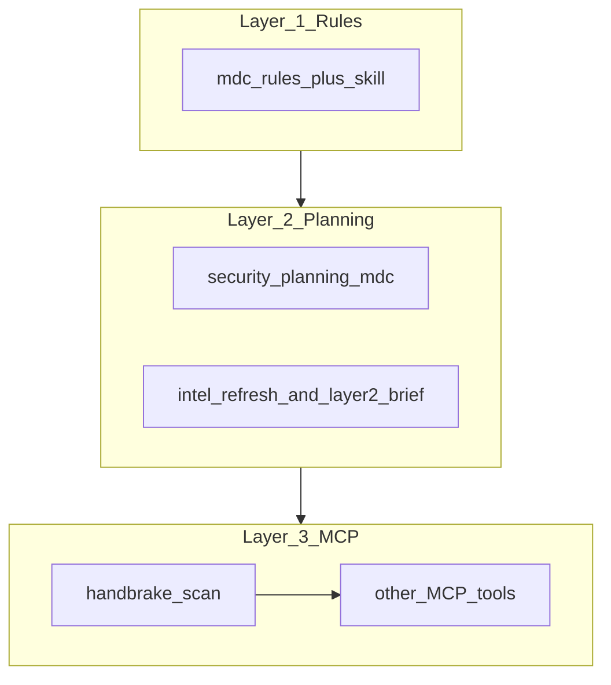
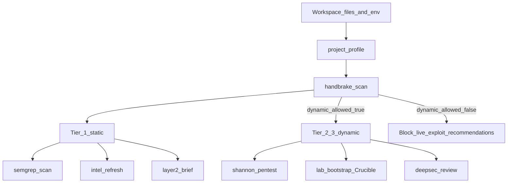
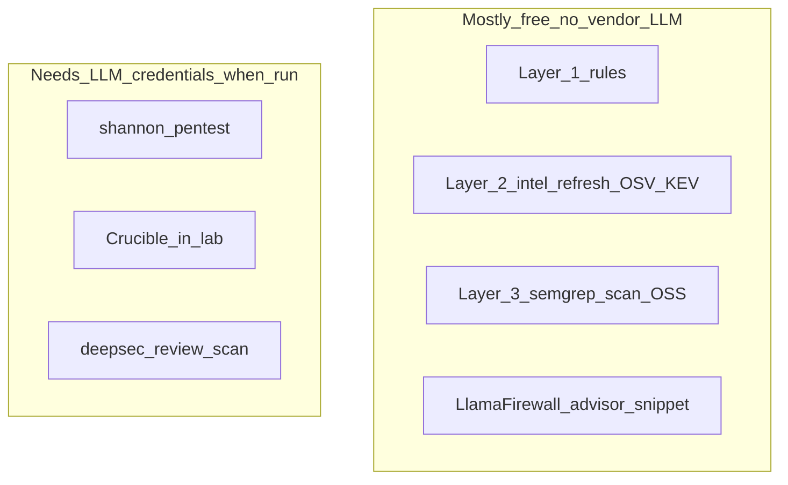
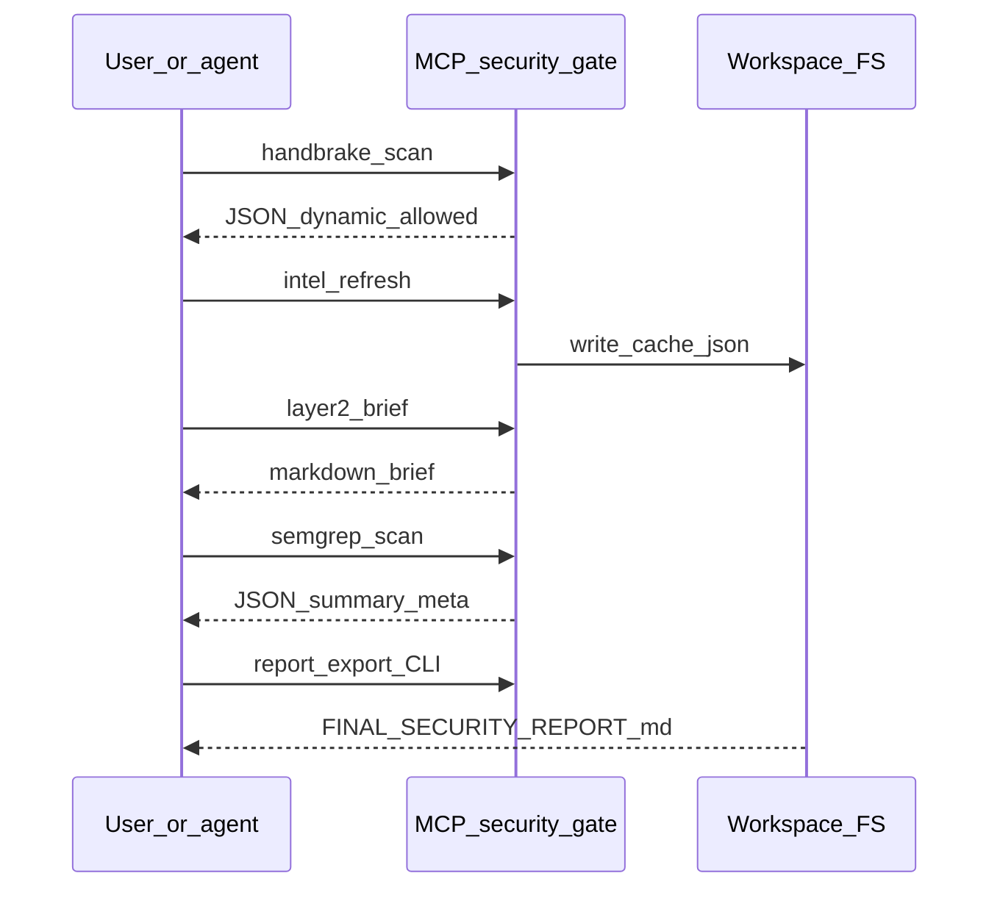

# Security Gate — architecture, flows, and outputs

**Audience:** anyone who read the [README](../README.md) and wants **diagrams**, **free vs paid paths**, and a **per-tool output** reference without opening the MCP source yet.  
**Language:** English (canonical for GitHub).

---

## Visual assets policy

- **Mermaid** diagrams in markdown are the default: they version in Git and render on GitHub.
- **Logos:** do not copy vendor trademark artwork into the repo unless you have explicit permission and track the license. Use **links** and optional [Shields.io](https://shields.io/) badges. First-party exports may live under [`docs/assets/`](assets/README.md).
- **Deep technical behavior** (code paths, env resolution): [TECHNICAL_DEEP_DIVE.md](TECHNICAL_DEEP_DIVE.md) and [CONFIGURATION_MAP.md](CONFIGURATION_MAP.md).

---

## The three layers (stack)

| Layer | What it is | Runs without API keys? |
|-------|------------|---------------------------|
| 1 | `.mdc` rules + [`skills/security-gate/SKILL.md`](../skills/security-gate/SKILL.md) | Yes |
| 2 | Planning rule + optional **KEV/OSV** context | Yes for `layer2_brief` reading cache; `intel_refresh` needs outbound HTTPS, not vendor LLM keys |
| 3 | MCP server: profile, intel, Semgrep wrapper, lab, Tier-2/3 wrappers | **Tier 1 tools:** yes. **Shannon / Crucible / DeepSec scans:** need LLM credentials when those actions run |

---

## Static path vs dynamic path (Tier 1 vs Tier 2/3)

**Static (Tier 1)** means: no autonomous pentest, no agentic attack loop, no DeepSec **scan** — only rules, profiling, OSS Semgrep, public intel feeds (HTTPS), advisor text, and install plans.

**Dynamic (Tier 2/3)** means: Shannon pentest, Crucible attacks inside the lab container, or DeepSec **scan** — these consume **LLM-backed** services and must only target **disposable** environments when the handbrake allows it.

---

## Free vs paid coverage by layer

Narrative detail and OpenRouter/Groq trade-offs: [FREE_VS_PAID_LLM.md](FREE_VS_PAID_LLM.md). Env var matrix: [LLM_AND_KEYS_MATRIX.md](LLM_AND_KEYS_MATRIX.md).

---

## End-to-end: who calls what, and what lands on disk

---

## MCP tool reference (outputs and artifacts)

| Tool | Primary layer | Typical output in chat | On-disk artifacts (when applicable) |
|------|---------------|-------------------------|--------------------------------------|
| `handbrake_scan` | 3 | JSON: `dynamic_allowed`, `reasons[]` | None |
| `project_profile` | 2–3 | JSON stack signals | None |
| `intel_refresh` | 2 | JSON status + counts | `.security-gate/cache/kev.json`, `intel-meta.json`, `osv-samples.json` |
| `layer2_brief` | 2 | Markdown brief | Reads cache only |
| `semgrep_scan` | 3 | JSON + optional `scan_meta`, `elapsed_ms` | None by default |
| `lab_bootstrap` | 3 | JSON install_plan / compose status | Docker volumes for lab stack |
| `shannon_pentest` | 3 | JSON actions; pentest spawns Shannon | `<workspace>/.shannon/` after runs |
| `deepsec_review` | 3 | JSON actions; scan runs DeepSec | `<workspace>/.deepsec/`, findings under `.deepsec/findings/` |
| `llamafirewall_advisor` | 3 | JSON + Python snippet string | None (user pastes snippet) |

**Bundled export (CLI):** `npm run report:export` merges handbrake JSON + optional Semgrep + template into `.security-gate/reports/FINAL_SECURITY_REPORT_*.md` — see [templates/FINAL_SECURITY_REPORT.template.md](templates/FINAL_SECURITY_REPORT.template.md).

---

## Glossary

| Term | Meaning |
|------|---------|
| **Handbrake** | `handbrake_scan` merging process env + workspace `.env*` to decide if **dynamic** tooling should be recommended. |
| **Tier 1** | Static / intel / OSS Semgrep path — no LLM vendor keys for the core story. |
| **Tier 2** | Shannon-style **live** pentest against a URL (disposable only). |
| **Tier 2.5** | LlamaFirewall **runtime** guardrails (advisor ships a snippet; execution is in your app). |
| **Tier 3** | DeepSec deep repo review — **token spend**; use default `limit` first. |

---

## See also

- [FAQ.md](FAQ.md) — short conceptual Q&A  
- [TROUBLESHOOTING.md](TROUBLESHOOTING.md) — when MCP, Docker, or hooks fail  
- [README.md](../README.md) — demo targets (`npm run demo:webapp` / `demo:agent`) and clone scripts  
- [API_KEY_ACQUISITION.md](API_KEY_ACQUISITION.md) — where to obtain keys safely  
